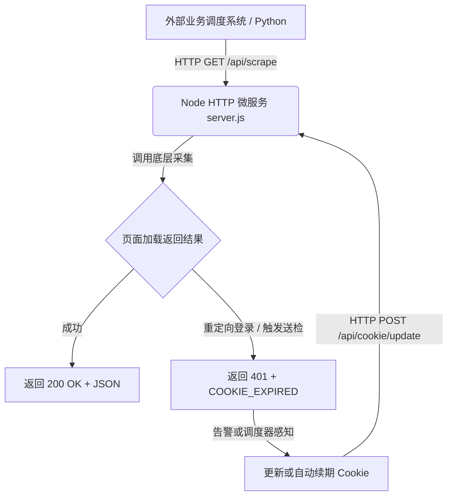

# 速卖通抓取微服务架构与开发实践 (Architecture & Engineering Guide)

本文档阐述 `my-aliexpress-crawler` 项目的设计初衷、架构分层原则、本地抓取库依赖与会话状态持久化方案。

---

## 1. 为什么采用“主业务工程 + 本地抓取库依赖”架构？

在日常 Node.js / 爬虫开发中，核心爬虫底层库往往会有开源上游更迭。为了做到 **“业务定制与底层库零耦合”**：

```text
my-aliexpress-crawler/                 <-- 主业务微服务层 (完全掌控业务 API / 会话管理 / 数据库)
├── server.js                          # 常驻 HTTP 微服务主程序
├── interactive_scraper.js             # 交互验证与凭证固化脚本
├── get_full_json.js                   # CLI 单次采集命令脚本
├── utils/cookieUtils.js               # 会话解析与转换类
└── libs/
    └── aliexpress-product-scraper/    <-- 底层抓取核心库（以 package.json 的 file: 依赖接入）
```

1. **业务主工程** 负责 HTTP 接口层设计、重试队列、会话生命周期维护与凭证持久化。
2. **`libs/aliexpress-product-scraper`** 通过 `package.json` 的 `file:./libs/aliexpress-product-scraper` 本地依赖接入；业务 API、会话和 CSP 逻辑保留在主工程中，避免把业务配置夹入底层抓取库。

---

## 2. 凭证管理与 Profile 固化机制

### 传统模式的痛点
如果每次传入新的内存 Cookie，无头浏览器启动时都会分配一个全空的临时缓存，导致验证态丢失并频繁触发验证码。

### 本项目的“零侵入固化”机制
1. **浏览器挂载持久目录**：HTTP 抓取服务通过 `utils/tabScraper.js` 使用主工程下的 `user_data_profile_puppeteer/`；
2. **主动注入 + 自动保存**：读取外部 `cookie.txt` 或 API 传来的新 Cookie 注入网页；
3. **Chromium 原生数据库存储**：注入后只要网页正常发起请求，Chrome 引擎底层会自动将凭证写入 `user_data_profile_puppeteer/Default/Network/Cookies` SQLite 数据库中。
4. 后续 HTTP 抓取任务使用 `userDataDir: "./user_data_profile_puppeteer"` 即可复用认证状态。`interactive_scraper.js` 和 `get_full_json.js` 仍使用旧的 `user_data_profile/`，在统一前不应假定它们与服务共用登录态。

---

## 3. 会话自动自愈闭环设计

系统推荐采用如下监控自愈工作流，保证无人值守稳定运转：


